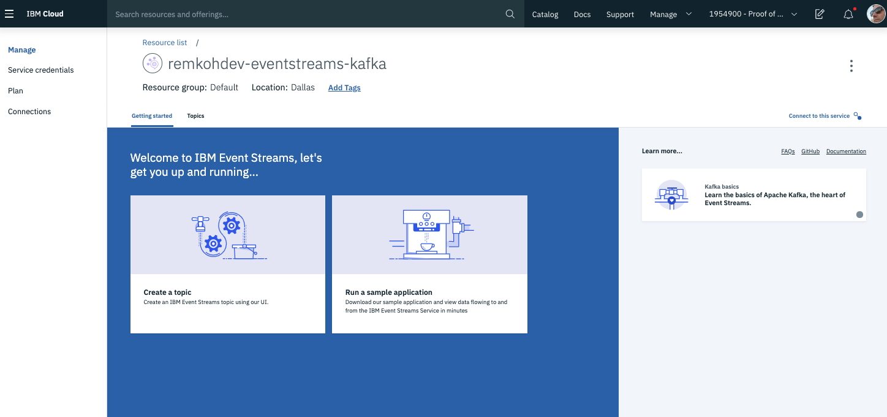
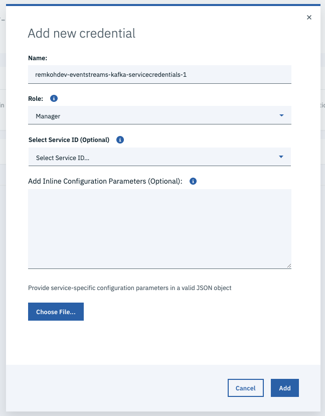
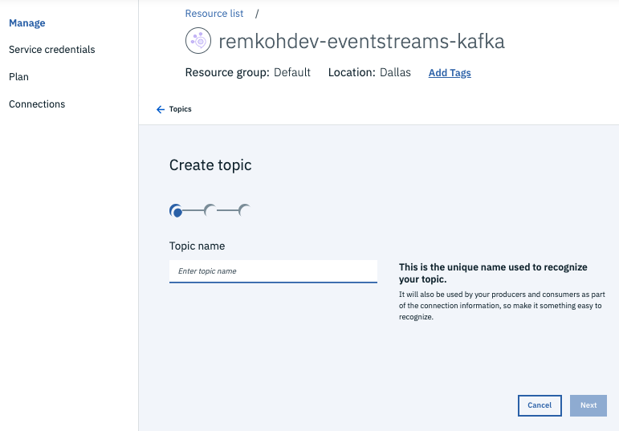

# Setup

To setup a managed instance of Apache Kafka on IBM Cloud, create an IBM Event Streams service on IBM Cloud.

IBM Event Streams is a managed service of an Apache Kafka instance on IBM Cloud. IBM Event Streams is a high-throughput message bus built on Apache Kafka, supporting all Kafka APIs and optimized for event ingestion and event stream distribution on IBM Cloud.

If you already have installed the Event Streams plugin and are logged into IBM Cloud, jump to "Initialize the Event Streams Service".

## Install the Event Streams plugin

Assuming the IBM Cloud Developer Tools CLI is already installed, add the plugin for Event Streams,

	```console
	$ ibmcloud plugin install event-streams
	Looking up 'event-streams' from repository 'IBM Cloud'...
	Plug-in 'event-streams 2.0.0' found in repository 'IBM Cloud'
	Attempting to download the binary file...
	30.95 MiB / 30.95 MiB [===========================================] 100.00% 17s
	32455568 bytes downloaded
	Installing binary...
	OK
	Plug-in 'event-streams 2.0.0' was successfully installed into /Users/user1/.bluemix/plugins/event-streams. 
	Use 'ibmcloud plugin show event-streams' to show its details.
	```

List the plugins,

	```console
	$ ibmcloud plugin list
	```

To initialize the Event Streams plugin, first login to IBM Cloud,

	```console
	$ ibmcloud login -a cloud.ibm.com -r us-south -g Default -u <username> -p <password> 
	$ ibmcloud target --cf
	```

### Initialize the Event Streams Service

Then initialize the Event Streams plugin,

	```console
	$ ibmcloud es init
	
	Select an Event Streams instance:
        1. acct-eventstreams-user1
        2. acct-eventstreams-user2
        3. acct-eventstreams-user3
        Enter a number> 3

	API Endpoint: 	https://123abc4d5efgh67i.svc01.us-south.eventstreams.cloud.ibm.com
	OK
	```

## Using the IBM Cloud Developer Tools CLI and Event Streams plugin

* Create an instance of the IBM Event Streams service,

	```console
	$ ibmcloud resource service-instance-create user1-eventstreams messagehub standard us-south
	Creating service instance remkohdev-eventstreams in resource group default of account USER1's Account as user1@email.com...
	OK
	Service instance user1-eventstreams was created.
					
	Name:         user1-eventstreams   
	ID:           crn:v1:bluemix:public:messagehub:us-south:a/1ab2c3de456789fg01h23i4j5k6l78mn:12a34bc5-de67-8f9g-h012-34i567jk8901::   
	GUID:         12a34bc5-de67-8f9g-h012-34i567jk8901   
	Location:     us-south   
	State:        active   
	Type:         service_instance   
	Sub Type:        
	Created at:   2019-10-17T15:04:16Z   
	Updated at:   2019-10-17T15:04:16Z
	```

* Create a new topic called `greetings`,

	```console
	$ ibmcloud es topic-create greetings --partitions 1
	Created topic greetings
	OK
	```

For more details about using the Event Streams CLI Plugin, see [Lab05](../Lab05/README.md).

## Using the IBM Cloud UI

To setup an Apache Kafka instance on IBM Cloud:
* Go to the IBM Cloud Catalog,
* Search the catalog for Kafka or Event Streams,
* Click the Event Streams service,
* Click the Create button,

	

* Go to the Service credentials page,
* Click the New credential button,
* Name the credential <username>-eventstreams-kafka-servicecredentials-1, 

	

* Click the Add button,
* You will need the service credentials to the Event Streams service to access the Kafka server,

Next, create a topic:
* Go to the Manage page to return to the service dashboard,
* Click the Create a topic pane, or go to the Topics tab and click the Create topic button,

	

* For Topic name enter greetings,
* Click Next,
* Keep the value for Partitions to 1,
* Click Next,
* Set Message Retention to A day,
* Click Create topic,
* A message will popup
  
  ```text
  Topic creation requested 
  A request to create topic 'greetings' has been made.
  ```

* It may take a while before the topic is created,

